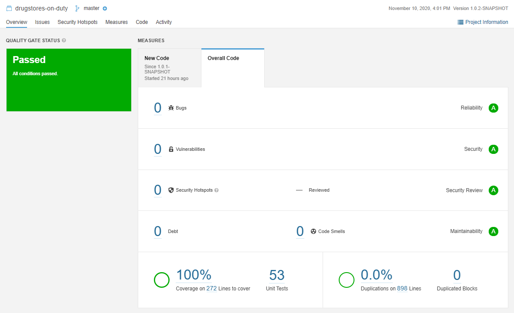

# Microservicio con API para consulta de farmacias de turno

> README.md sin tildes intencionalmente.

> Swagger en http://drugstores-on-duty-api.sa-east-1.elasticbeanstalk.com/swagger-ui.html

### Provee los siguientes endpoints:
> [GET]&#8195;/api/v1/farmacias-de-turno

Retorna las farmacias de turno filtradas por los siguientes parametros.

Parametro | Obligatorio | Valor por defecto | Descripcion
------------ | :-------------: | :----------: | -------------
region | no | 7 | Indice de la region para filtrar
comuna | no |  | Nombre de la comuna para filtrar
local | no |  | Nombre de la farmacia para filtrar
solo-de-turno | no | false | Indica si solo trae las farmacias de turno o incluye las sin turno
Salida:
```json
[
    {
        "local": "FARMACIA",
        "direccion": "LA DIRECCION",
        "telefono": "+5612345667",
        "latitude": -123.012345678901234,
        "longitud": 123.012345678901234,
        "turno": true
    }
]
```
Detalle:
Atributo | Descripcion
------------ | -------------
local | Nombre de la farmacia 
direccion | Direccion de la farmacia 
telefono | Telefono de la farmacia 
latitude | Latitud geografica de la farmacia 
longitud | Longitud geografica de la farmacia 
turno | Bandera si la farmacia esta o no de turno
> [GET]&#8195;/api/v1/regiones

Retorna las regiones del pais.

Salida
```json
{
    "REGION DE COQUIMBO": "5",
    "REGION DEL MAULE": "9",
    "REGION METROPOLITANA": "7",
    "REGION DE MAGALLANES Y LA ANTARTICA CHILENA": "15",
    "REGION DE ANTOFAGASTA": "3",
    "REGION DE TARAPACA": "2",
    "REGION DE LA ARAUCANIA": "11",
    "REGION DEL LIBERTADOR GENERAL BERNARDO OHIGGINS": "8",
    "REGION DE LOS LAGOS": "13",
    "REGION DE ÑUBLE": "16",
    "REGION DE ARICA Y PARINACOTA": "1",
    "REGION DE AYSEN DEL GENERAL CARLOS IBAÑEZ DEL CAMPO": "14",
    "REGION DEL BIO-BIO": "10",
    "REGION DE LOS RIOS": "12",
    "REGION DE ATACAMA": "4",
    "REGION DE VALPARAISO": "6"
}
```

> [GET]&#8195; /api/v1/comunas

Retorna las comunas de una region.

Parametro | Obligatorio | Valor por defecto | Descripcion
----------| :-------------: | :-----------: | -------------
region    | no              | 7             | Indice de la region para filtrar

Salida
```json
{
    "SAN ROSENDO": "241",
    "ALTO BIO BIO": "346",
    "SANTA JUANA": "243"
    ...
}
```

### Construccion

```Windows
./gradlew build
```

### Propiedades para despliegue cloud

Propiedad                                               | Obligatorio | Valor por defecto | Descripcion
------------------------------------------------------- | :---------: | :---------------: | -----------
env.admin-division.base-url                             | SI          |                   | URL base para el servicio que provee comunas y regiones
env.admin-division.communes-path                        | SI          |                   | Path para el servicio que provee comunas
env.admin-division.regions-path                         | SI          |                   | Path para el servicio que provee regiones
env.drugstores-on-duty.base-url                         | SI          |                   | URL base para el servicio que provee farmacias
env.drugstores-on-duty.drugstores-by-region-path        | SI          |                   | Path con la operacion que retorna farmacias de cada region
env.drugstores-on-duty.drugstores-on-duty-path          | SI          |                   | Path con la operacion que retorna farmacias de turno
env.drugstores.default-region                           | NO          | 7                 | Region por defecto segun lo solicitado
env.drugstores.feign.admin-divisions.connect-timeout    | NO          | 5000              | Timeout hystrix
env.drugstores.feign.admin-divisions.read-timeout       | NO          | 5000              | Timeout hystrix
env.drugstores.feign.drugstores-on-duty.connect-timeout | NO          | 5000              | Timeout hystrix
env.drugstores.feign.drugstores-on-duty.read-timeout    | NO          | 5000              | Timeout hystrix
env.drugstores.feign.hystrix.enabled                    | NO          | true              | Bandera si habilitamos o no hystrix
env.drugstores.feign.logging.level                      | NO          | NONE              | Nivel de log de hystrix, NONE, BASIC, HEADERS, o FULL
env.drugstores.hystrix.base-timeout                     | NO          | 5000              | Timeout hystrix
env.drugstores.logging.level.root                       | NO          | ERROR             | Nivel de log del resto de la aplicacion
env.drugstores.logging.level.service                    | NO          | INFO              | Nivel de log de la aplicacion

> El ultimo analisis de sonar  con las reglas por defecto es el siguiente, sin ninguna exclusion.




